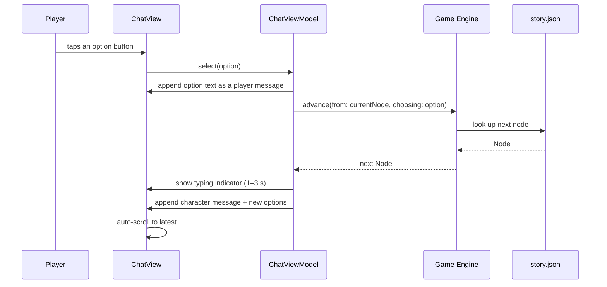

# Architecture — DarkDive

> Architectural decisions and technical view of the system.

## Overview

DarkDive is a single-target native iOS app. Everything runs on-device: there is no backend,
no network dependency, and (in v1) no AI. The narrative is data; the engine is a
deterministic state machine; the UI is a chat.

```
┌─────────────────────────────────────────────┐
│  Presentation (SwiftUI)                     │
│  ChatView · MessageBubble · OptionButtons   │
│                    ▲                        │
│                    │ @Observable            │
│  ChatViewModel ────┘                        │
└──────────┬──────────────────────────────────┘
           │ current node + selected option
           ▼
┌─────────────────────────────────────────────┐
│  Domain — Game Engine (FSM)                 │
│  advance(from:choosing:) -> Node            │
└──────────┬──────────────────────────────────┘
           │ node ids
           ▼
┌─────────────────────────────────────────────┐
│  Data                                       │
│  StoryRepository → story.json (Codable)     │
└─────────────────────────────────────────────┘
```

In v1 (spec 001) only the Presentation layer exists, fed by mocked data. The Domain and
Data layers arrive with spec 002 and are wired together in spec 003.

## Approach: Spec-Driven Development (SDD)

Work flows in one direction: **decision → spec → implementation → review**.

1. Design decisions are made with Antigravity and recorded in `docs/decisions/`.
2. Each shippable slice becomes a numbered spec in `docs/specs/NNN-name.md`, copied from
   `_template.md`, with explicit acceptance criteria.
3. A spec moves `draft → review → approved` before any code is written against it.
4. Claude Code implements only what the approved spec describes, then the spec moves to
   `implemented`.
5. Decisions with long-lived architectural consequences are additionally captured as ADRs
   in `docs/adr/`.

The spec is the contract. Ambiguity in a spec is a bug in the spec, not a license to
improvise.

## System Layers

### Presentation

SwiftUI views plus `@Observable` view models (MVVM).

- `ChatView` — the single screen: scrollable message list, inline option buttons, typing
  indicator, auto-scroll.
- `MessageBubble` — renders one message, styled by sender (player vs. chat character).
- `ChatViewModel` — owns the displayed message list, the currently available options, and
  the typing/idle UI state. It orchestrates timing and animation; it does **not** decide
  narrative outcomes.

### Domain

The **Game Engine**: a local finite state machine in pure Swift, no framework dependencies,
fully unit-testable.

- The story is a **node graph (dialog tree)**.
- Each node = one chat-character message + the list of options available from it.
- Each option points to the next node id.
- Terminal nodes are endings.
- Nodes may later carry conditions (future spec: "only show this option if sanity > 50").
- The engine is deterministic: same node + same option → same next node.

**State variables (future, spec 004+):** sanity, the character's trust in the player,
discovered clues (flags/inventory). **In v1 there are no state variables at all** — only
the node graph.

### Data

- `story.json` — the full node graph, bundled with the app.
- Decoded with `Codable` into domain models. No third-party parsing.
- **Fully data-driven:** authoring new content means editing JSON, never Swift.
- No persistence in v1 — each session starts from zero. SwiftData is a future spec (005+).

### AI / Agents

Two distinct meanings of "agent" apply to this project; keep them separate.

**Development-time agents** (Antigravity for design and docs, Claude Code for
implementation) are described in [`AGENTS.md`](../AGENTS.md).

**Runtime AI** does not exist in v1 and is deliberately deferred until the game loop is
validated. When it arrives, it is bound by the non-negotiable rule:

> Foundation Models never modify game state directly. The AI interprets and narrates; the
> Game Engine decides consequences and owns the state.

Concretely, the future AI layer sits *beside* the engine, never above it: it parses the
player's free-form input into an intent the engine can act on, and it renders the engine's
resulting node into in-character prose. Node transitions remain the engine's exclusive
authority.

## Data Flow



## Architectural Decisions (ADRs)

ADRs live in [`docs/adr/`](adr/), created from
[`ADR-001-template.md`](adr/ADR-001-template.md).

Decisions taken so far are recorded in
[`docs/decisions/grill-me-session-2026-07-20.md`](decisions/grill-me-session-2026-07-20.md)
and summarized in the tech stack table in [`AGENTS.md`](../AGENTS.md). Candidates to be
promoted into formal ADRs:

- Local FSM over an AI-driven narrative engine
- JSON + `Codable` over a scripting language for narrative authoring
- MVVM with `@Observable` over alternative SwiftUI state patterns
- iOS 17+ as the deployment floor

## External Dependencies

**None.** The project uses only Apple frameworks (SwiftUI, Foundation). SPM is the
dependency manager of record if that ever changes, but adding a dependency is a decision
that requires an ADR.

No backend, no network calls, no analytics SDKs, no third-party services.

## Security and Privacy

- **No data collection.** The app gathers no personal data, no analytics, no telemetry.
- **No network access.** Everything runs on-device and offline; there is no server to
  breach and nothing in transit.
- **No persistence in v1**, so no player data is stored at all. When persistence lands
  (spec 005+) it will be local-only via SwiftData.
- **Content safety:** the setting draws on the Ratanabá legend as world inspiration only.
  Real people associated with Amazonian legends — researchers, real Indigenous
  individuals, disappeared explorers — are never depicted as characters.
- **Future AI:** any AI must run on-device (spec 006+ is explicitly *local* AI), keeping
  the no-network, no-data-collection posture intact.
