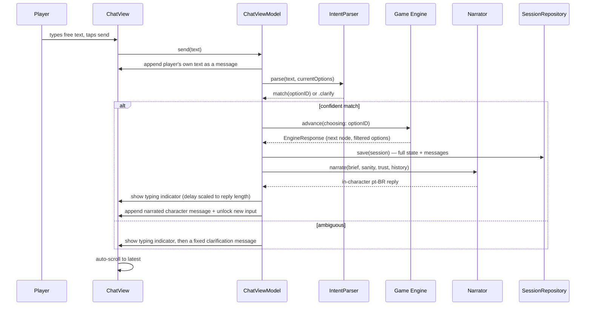

# Architecture — DeepDive

> Architectural decisions and technical view of the system.

## Overview

DeepDive is a single-target native iOS app. Everything runs on-device: there is no backend
and no network dependency. AI (Foundation Models) runs on-device too — see "AI / Agents"
below. The narrative is data; the engine is a deterministic state machine; the UI is a chat.

```
┌─────────────────────────────────────────────┐
│  Presentation (SwiftUI)                     │
│  ChatView · MessageBubble · ComposerView    │
│                    ▲                        │
│                    │ @Observable            │
│  ChatViewModel ────┘                        │
└──────────┬──────────────────────────────────┘
           │ free text                │ narrated reply
           ▼                          │
┌─────────────────────┐               │
│  IntentParser        │              │
│  text → option id    │              │
└──────────┬────────────┘             │
           ▼                          │
┌─────────────────────────────────────────────┐
│  Domain — Game Engine (FSM)                 │
│  advance(choosing:) -> EngineResponse       │
│  tracks flags/ints, evaluates conditions    │
└──────────┬──────────────────────────────────┘
           │ node ids                 ▲
           ▼                          │ raw node text
┌─────────────────────┐    ┌─────────────────────┐
│  Data                │    │  Narrator            │
│  StoryRepository /    │    │  brief → in-character│
│  SessionRepository    │    │  pt-BR prose          │
└─────────────────────┘    └─────────────────────┘
```

Presentation talks to the engine only through `ChatViewModel`. `IntentParser` and
`Narrator` sit beside the engine (never above it): they translate at the boundary, but
every state change and node transition is still decided exclusively by `GameEngine`.

## Approach: Spec-Driven Development (SDD)

Work flows in one direction: **decision → spec → implementation → review**.

1. Design decisions are made with Antigravity and recorded in `docs/decisions/`.
2. Each shippable slice becomes a numbered spec in `docs/specs/NNN-name.md`, copied from
   `_template.md`, with explicit acceptance criteria.
3. A spec moves `draft → review → approved` before any code is written against it.
4. Claude Code implements only what the approved spec describes, then the spec moves to
   `implemented`.
5. Decisions with long-lived architectural consequences are additionally captured as ADRs
   in `docs/adr/`.

The spec is the contract. Ambiguity in a spec is a bug in the spec, not a license to
improvise.

## System Layers

### Presentation

SwiftUI views plus `@Observable` view models (MVVM).

- `ChatView` — the single screen: scrollable message list, text input composer, typing
  indicator, auto-scroll.
- `MessageBubble` — renders one message, styled by sender (player vs. chat character).
- `ChatViewModel` — owns the displayed message list and the typing/idle UI state. It
  orchestrates timing, auto-save, and calls into `IntentParser`/`Narrator`; it does **not**
  decide narrative outcomes — only `GameEngine` does.

### Domain

The **Game Engine**: a local finite state machine in pure Swift, no framework dependencies,
fully unit-testable.

- The story is a **node graph (dialog tree)**.
- Each node = one chat-character message + the list of options available from it.
- Each option points to the next node id, and may carry `conditions`/`effects`.
- Terminal nodes are endings.
- The engine is deterministic: same node + same option → same next node.

**State variables:** integer variables (`sanity`, `trust`, ...) and boolean flags, seeded
from `story.json`'s `initialState` and mutated by option `effects` (`delta`/`set`, clamped
0–100 for integers). `conditions` (`eq`/`gte`/`lte`) filter which options an
`EngineResponse` exposes.

### Data

- `story.json` — the full node graph, bundled with the app, decoded via `StoryRepository`.
- Decoded with `Codable` into domain models. No third-party parsing.
- **Fully data-driven:** authoring new content means editing JSON, never Swift.
- `SessionRepository` (SwiftData) auto-saves the full session — engine state + message
  history — after every player choice, in a single upsert slot, and deletes the record once
  a terminal node is reached. See Spec 005.

### AI / Agents

Two distinct meanings of "agent" apply to this project; keep them separate.

**Development-time agents** (Antigravity for design and docs, Claude Code for
implementation) are described in [`AGENTS.md`](../AGENTS.md).

**Runtime AI** was deliberately deferred until the game loop was validated (Specs 001–005);
it landed in Specs 006–007. It is bound by the non-negotiable rule:

> Foundation Models never modify game state directly. The AI interprets and narrates; the
> Game Engine decides consequences and owns the state.

Concretely, the AI layer sits *beside* the engine, never above it:
- **`IntentParser`** (Spec 006) converts the player's free-text input into an option ID the engine acts on.
- **`Narrator`** (Spec 007) rewrites the engine's raw node text into natural, emotionally-adaptive pt-BR prose before it appears on screen.

Node transitions remain the engine's exclusive authority. Both components conform to protocols with `Static*` stub implementations so the rest of the codebase and all tests remain unaffected.

Requires **iOS 26+** and Apple Intelligence (Foundation Models runs fully on-device; no network, no cost).

## Data Flow



## Architectural Decisions (ADRs)

ADRs live in [`docs/adr/`](adr/), created from
[`ADR-001-template.md`](adr/ADR-001-template.md).

Decisions taken so far are recorded across the `/grill-me` sessions in
[`docs/decisions/`](decisions/) (one file per major planning session) and summarized in the
tech stack table in [`AGENTS.md`](../AGENTS.md). Candidates to be promoted into formal ADRs:

- Local FSM over an AI-driven narrative engine
- JSON + `Codable` over a scripting language for narrative authoring
- MVVM with `@Observable` over alternative SwiftUI state patterns
- iOS 26+ as the deployment floor (raised from 17+ in Spec 006, for Foundation Models)

## External Dependencies

**None beyond Apple frameworks.** The project uses only Apple frameworks (SwiftUI, Foundation,
SwiftData, FoundationModels). SPM is the dependency manager of record if that ever changes,
but adding a dependency requires an ADR.

No backend, no network calls, no analytics SDKs, no third-party services.

## Security and Privacy

- **No data collection.** The app gathers no personal data, no analytics, no telemetry.
- **No network access.** Everything runs on-device and offline; there is no server to
  breach and nothing in transit.
- **Local-only persistence.** The single saved session (Spec 005) lives entirely in an
  on-device SwiftData store; it is never transmitted anywhere and is deleted once a
  playthrough ends.
- **Content safety:** the setting draws on the Ratanabá legend as world inspiration only.
  Real people associated with Amazonian legends — researchers, real Indigenous
  individuals, disappeared explorers — are never depicted as characters.
- **On-device AI.** `IntentParser`/`Narrator` (Specs 006–007) run entirely via Apple's
  Foundation Models, on-device — no network call, no data leaves the phone.
